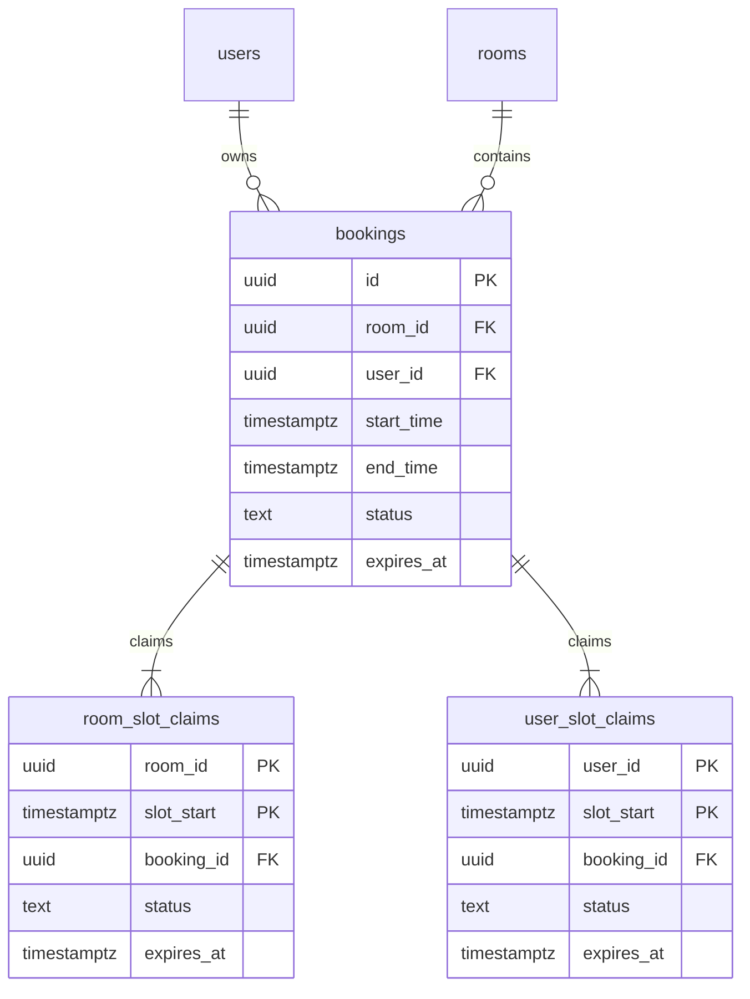

# Decisions

## Schema choices

(How you designed the `bookings` table and why. Indexes, constraints, types.)

- Main `bookings` table with `room_id`, `user_id`, `start_time`, `end_time`, `status`, and optional `expires_at`

- `timestamptz` for booking times, because timezone handling should be explicit

- Slot claim tables for concurrency:
  - `room_slot_claims` with primary key `(room_id, slot_start)`
  - `user_slot_claims` with primary key `(user_id, slot_start)`

- A booking claims every 30-minute slot in one transaction

- This blocks room overlap and also blocks same user booking different rooms at the same time

- Expired holds can be overwritten, confirmed bookings can not

- If any claim fails, transaction rolls back and API returns `409`

- Indexes for room/time search, user/time search, and expired holds cleanup

- Slonik raw SQL + Zod validation for returned rows

## Live updates

(How clients receive updates. What you chose and what you considered.)

PostgreSQL's `LISTEN/NOTIFY` + SSE on `GET /bookings/events` (+ `@microsoft/fetch-event-source` to include Authorization header)

Event `bookings.changed` triggers refetch on the FE, also window focus and near hold expiry time

I did not add Redis, WebSockets, or Socket.IO

## ~~Boilerplate~~ changes

(Anything in the provided code you modified, removed, or replaced, and why.)

- DTOs, entities, zod+slonik schemas, repositories, and services for rooms, auth responses, notifications, and bookings

- RESTful API:
  - `POST /bookings` for direct confirmed bookings
  - `DELETE /bookings/:id` for owner-only cancellation
  - `POST /bookings/holds` and `POST /bookings/:id/confirm` for the "held slot" flow

* The user can switch room, change week, choose duration, create a hold, confirm it, and cancel their own booking

* E2E tests

## Bonus: holds

(If you attempted the bonus: design and tradeoffs. If you didn't: how would you approach it? Schema, concurrency, expiry.)

**Implemented**

- A hold use the same claim-table transaction as normal bookings, just with `status`=`"held"`
- Everything is transactional and determinable, expired holds are just ignored
- Cron task cleans up the table every 15 minutes for hygiene

## What I'd do with more time

(Honest list. We read this carefully.)

- Redesign the logic to ditch 30-minute alignment to allow more flexibility (gist indexes?)
- Fancier UI
- Playwright UI tests
- Better race-condition tests with real parallel requests
- More selective live updates (?)
